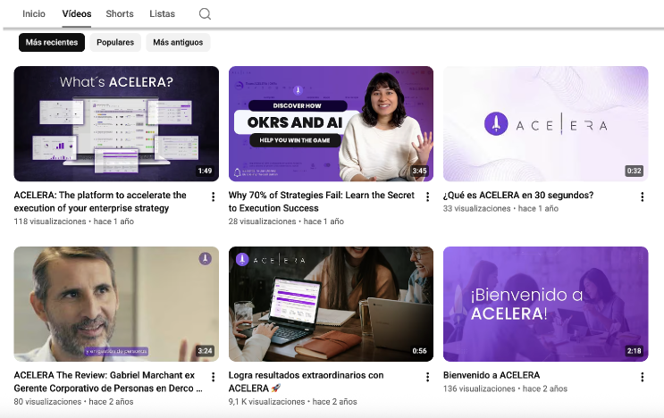
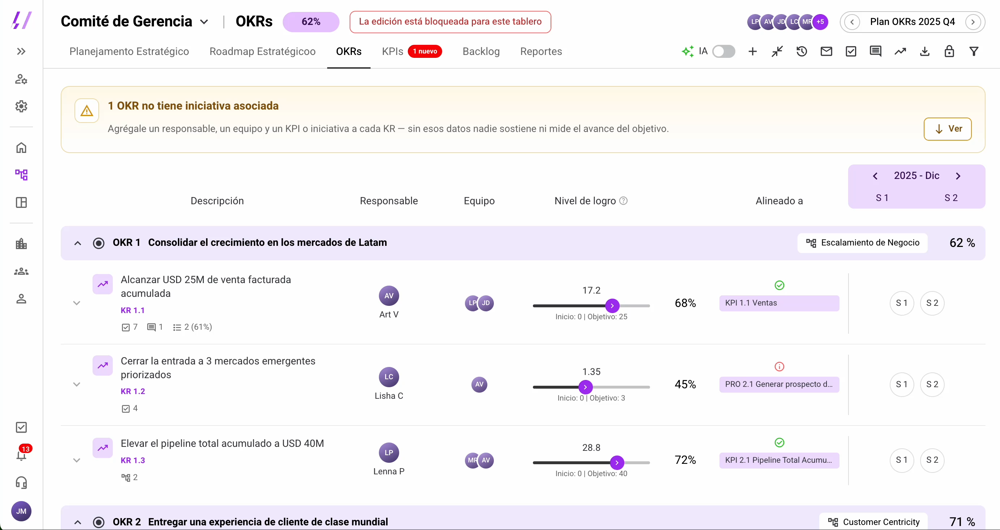
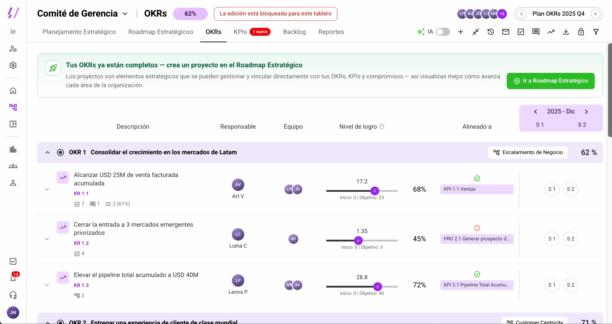
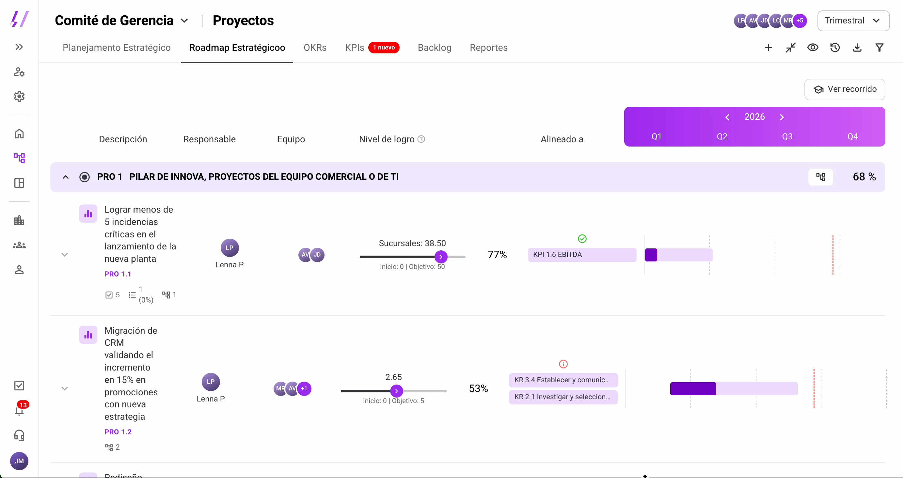

## Resumen

Acelera es una plataforma que reúne herramientas para la gestión estratégica de los equipos: OKRs, KPIs, planificación estratégica, roadmap, backlog, iniciativas y reportes. Los datos mostraban que casi todos los usuarios completaban el onboarding, pero muy pocos seguían usando la plataforma más allá de los OKRs.

Propusimos agregar acompañamiento contextual dentro del producto (alertas, un tour guiado y señalización) y diseñamos un A/B test de 3 meses para comprobar si cambia el comportamiento de los usuarios.

> La adopción no necesita más funcionalidades, necesita continuidad.

## Contexto y problema

Tener las funcionalidades disponibles no significa necesariamente que formen parte del día a día de los usuarios. Las métricas de los últimos 3 meses mostraban que los usuarios llegan a Acelera, pero no todos continúan el recorrido:

- **98%** completa el onboarding.
- **73,1%** de las sesiones ocurre en OKRs, la funcionalidad más utilizada.

**Oportunidad:** el 88% de las licencias no se convierte aún en usuarios recurrentes. De 1.715 usuarios base con licencia activa (no read-only), 200 son usuarios activos mensuales (MAU), es decir, el 11,66%.

**¿Cómo podríamos** hacer que Acelera se convierta en una plataforma integrada al flujo de trabajo de los usuarios, impulsando la adopción recurrente de sus distintas funcionalidades?

## Investigación

**Funnel de conversión.** El onboarding funciona: el 98% lo completa en 14 días (de 45 usuarios nuevos, 44 lo completaron) y crea su primer elemento estratégico real, un OKR. El salto se pierde entre "primer OKR" y "explora otro módulo".

| Sección | Sesiones |
| --- | --- |
| OKRs | 73,1% |
| KPIs | 5,0% |
| Plan | 4,6% |
| Roadmap | 4,6% |
| Backlog | 1,9% |

De los usuarios que entran al mes, 17 vuelven a entrar en el día y 49 en la semana. La conversión depende de que los usuarios regresen a la plataforma, y esa frecuencia varía según el proceso de trabajo de cada uno.

**Fuera de los datos.** En el onboarding se trabajan los primeros OKRs y se abren los módulos iniciales. El contenido en YouTube y LinkedIn da más detalle sobre cómo formular OKRs, y parte del contenido de YouTube sobre las secciones se replica en el Home.

**Hipótesis.** Hay una falta de conocimiento o comprensión de las secciones por parte de los usuarios activos, porque se asume que después del onboarding podrán manejar la plataforma por sí mismos.

## Proceso de diseño

**Qué queremos cambiar en los próximos 3 meses**

- **OKR:** diversificar el uso de la plataforma más allá de los OKRs, logrando que los usuarios recién incorporados se conviertan en usuarios activos integrando funcionalidades de valor a su flujo de trabajo.
- **KR 1, MAU:** aumentar el MAU de usuarios con permisos de edición (no read-only) del 11,6% al 15% al cierre del tercer mes.
- **KR 2, sesiones:** aumentar las sesiones en funcionalidades distintas a OKRs del 26,9% al 40%.

Priorizamos métricas de comportamiento. En una siguiente etapa se incluiría NPS relacional o CES para medir satisfacción, percepción y facilidad de uso.

**Cuatro áreas de acompañamiento exploradas**

1. **Comunicar visualmente el siguiente paso:** checklist, notificaciones, banners que conecten módulos, recomendaciones contextuales, tutoriales y chatbot.
2. **Onboarding interactivo y reutilizable:** llamadas a la acción para entrar por primera vez a cada módulo, señalización paso a paso y una guía que se pueda retomar.
3. **Señalización progresiva dentro del producto:** tooltips, mensajes instructivos y ayudas contextuales, como en "Nivel de logro".
4. **Incentivar comportamiento y recurrencia:** progreso, gamificación ligera, prueba social, recordatorios, newsletters o casos que inviten a volver.

**Una estrategia común: Descubrir, Guiar y Reforzar**

1. **Hacer visible el siguiente paso**, para que el recorrido no termine justo después del OKR.
2. **Mantener una guía persistente y explicar el contexto.** Cuando el usuario nota la señal, le explicamos el cómo y el porqué, y así reducimos el esfuerzo de aprender módulos nuevos solo.
3. **Reforzar el comportamiento para que vuelva.** Cada acción completada muestra progreso visual, para que volver se sienta como avance.

## Validación

El alcance del proyecto llegó hasta el plan de validación: el test de guerrilla y el A/B test quedaron diseñados, pero no se ejecutaron. La propuesta se validaría en dos pasos:

1. **Investigación evaluativa con test de guerrilla**, para afinar la propuesta rápidamente.
2. **A/B test**, para validar si genera un cambio real de comportamiento y confirmar que la mejora viene de la intervención y no de otros factores.

**Hipótesis del experimento.** Si agregamos acompañamiento contextual dentro de la plataforma para usuarios que ya completaron el onboarding y crearon sus primeros OKRs, entonces incorporarán otros módulos a su flujo de trabajo mensual y percibirán mayor valor en los próximos 3 meses, porque hoy dependen de descubrirlos solos.

**Diseño del experimento**

- **Universo:** 1.715 usuarios no read-only con licencia activa.
- **Muestra:** entre 125 y 135 usuarios nuevos incorporados durante el piloto (unos 42 por mes).
- **Duración:** 3 meses de captación más 14 días de observación.
- **Grupo control (62 usuarios):** plataforma actual, sin alertas de completitud en OKRs ni onboarding guiado en el Roadmap.
- **Grupo experimental (63 usuarios):** prototipo completo, con alertas de completitud en OKRs (iniciativa, responsable y equipo) y onboarding guiado en el Roadmap Estratégico.

**Métrica principal:** % de usuarios que crean un proyecto en los 7 días siguientes a su primer OKR.

**Métricas secundarias:**

- % de usuarios nuevos que usan al menos 2 módulos distintos a OKRs en sus primeros 14 días.
- % de compromisos con estado actualizado en la semana.
- % de sesiones en KPIs, comparando el grupo control con el experimental.

## Solución final

La intervención tiene tres elementos. Se pueden recorrer en el [prototipo navegable](https://valeriagt.github.io/acelera-prototipo/), que construí yo.

### 1. Alertas en el proceso de OKR

Una etiqueta en la pestaña de OKRs y un banner explicativo avisan cuando falta información. Los íconos de la columna "Alineado a" se ven en rojo si falta alinear y en verde si está completo.

Cuando el usuario completa los datos, la alerta cambia a verde y lo invita al siguiente módulo.

### 2. Tour guiado en el Roadmap Estratégico

Son cinco pasos que explican cómo funciona el módulo la primera vez que se entra. Se puede omitir y retomar cuando el usuario lo necesite. No interrumpe, acompaña.

### 3. Badge y señalización contextual

Un badge "1 nuevo" lleva a cada sección con alerta o banner, y un tooltip explica la columna "Nivel de logro".

### Qué esperamos lograr

Cerrar la brecha entre completar el onboarding de OKRs y adoptar la plataforma completa, sin depender de que el usuario la descubra por su cuenta. Las metas al cierre del tercer mes son elevar el MAU no read-only del 11,6% al 15% y las sesiones fuera de OKRs del 26,9% al 40%, con el Roadmap como el módulo con más movimiento esperado por ser el más cercano al OKR ya creado.

**Backlog adicional, por prioridad**

- **Media:** onboarding guiado reutilizable, con iluminación paso a paso y disponible más de una vez.
- **Baja:** más orientación para entender las etiquetas de OKR.
- **Mínima:** sesión de acompañamiento en el primer o segundo mes, priorizando clientes con más usuarios activos, y un chatbot que oriente paso a paso la creación de módulos.

## Aprendizajes

- **Los datos muestran dónde se pierde el usuario, no por qué.** El funnel señaló el salto entre el primer OKR y el siguiente módulo. Para entender la causa hubo que mirar fuera de los datos: el onboarding, el contenido en YouTube y LinkedIn, y lo que el producto asume que el usuario ya sabe.
- **Una baja adopción no se resuelve con más funcionalidades.** Acelera ya tenía las herramientas; lo que faltaba era continuidad entre ellas. Por eso la propuesta guía hacia los módulos que ya existen en lugar de sumar nuevos.
- **Definir la métrica antes que la pantalla.** Fijar primero el OKR, los KRs y la métrica principal del experimento dio un criterio para converger: de cuatro áreas exploradas salió una estrategia común y tres intervenciones que se pueden medir.
- **Medir comportamiento primero y percepción después.** Lo que los usuarios hacen (MAU, sesiones, proyectos creados) da una señal más directa para decidir qué iterar. El NPS o el CES quedan para una siguiente etapa.
- **Un plan de validación también es diseño.** Definir universo, muestra, grupos y duración obliga a aterrizar la hipótesis. Como el experimento no se ejecutó, las cifras de este caso son metas, no resultados.
