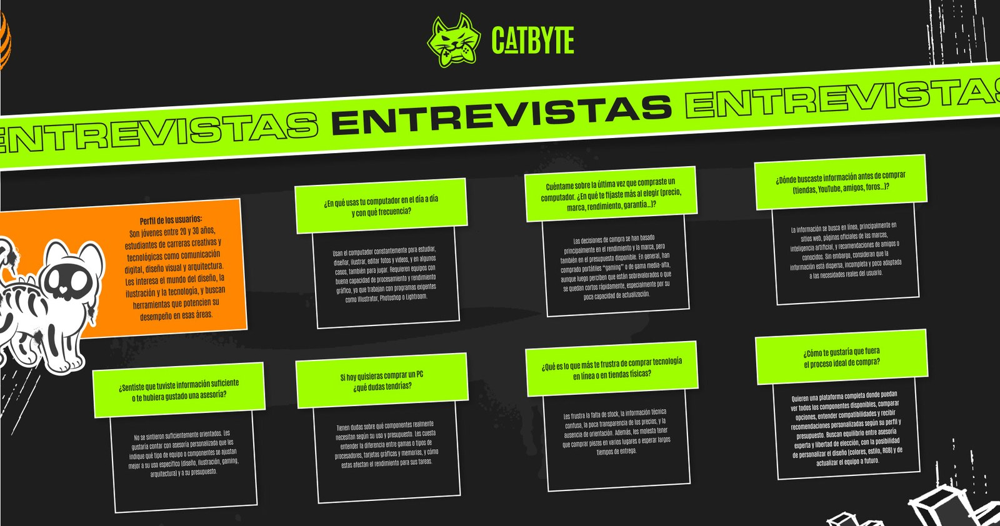
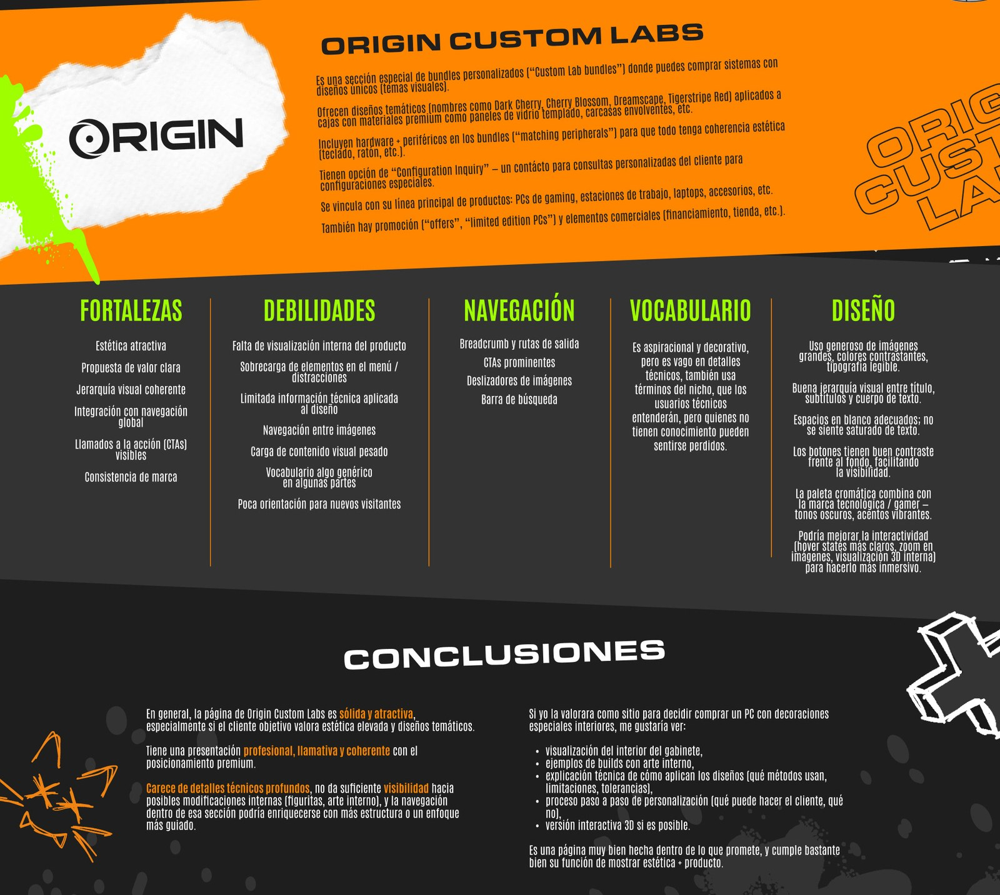
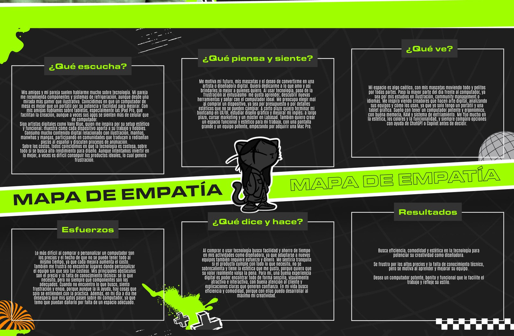
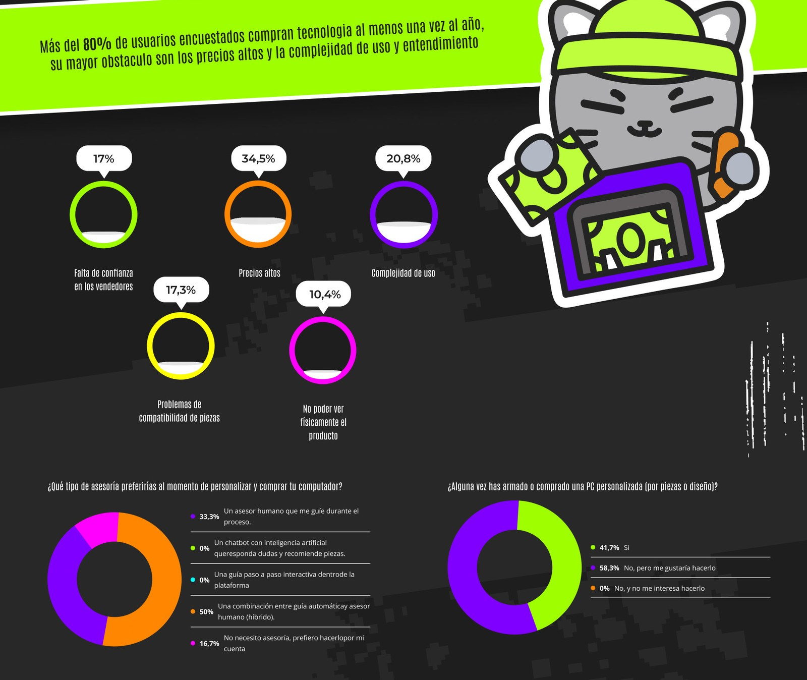
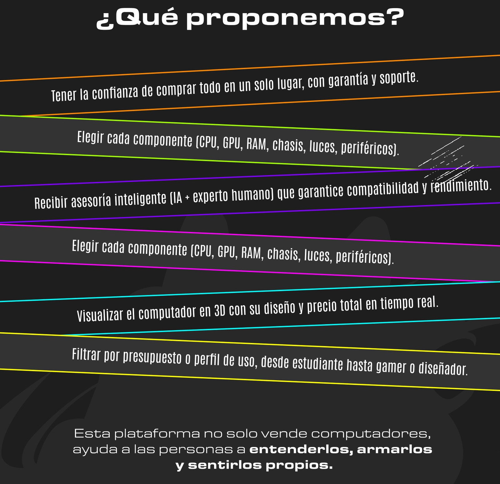

## Resumen

**Dos etapas con alcances distintos.** La investigación y la propuesta de valor fueron el entregable del bootcamp, realizado con Lianna González. Después decidí continuar el proyecto por iniciativa propia para construir el prototipo y la librería del sistema de diseño. Esa segunda etapa no formó parte del entregable académico.

Catbyte es una propuesta de plataforma confiable y atractiva para comprar computadores personalizados (armados según las necesidades y gustos de cada persona), consolas, mandos y productos geek y otakus. Su diferencial es la asesoría paso a paso, para que incluso quienes no saben de hardware puedan tomar buenas decisiones.

Lo desarrollé con Lianna González en el Bootcamp de Diseño UX/UI del BIT: entrevistas, benchmarking de cinco competidores, user personas, mapas de empatía y una encuesta, que llevaron a la propuesta de valor y a las funcionalidades clave.

> Esta plataforma no solo vende computadores, ayuda a las personas a entenderlos, armarlos y sentirlos propios.

## Contexto y problema

Muchas personas quieren un PC o una consola, pero no saben qué componentes elegir ni dónde comprar seguro. El mercado de consolas y PC en Colombia está lleno de páginas poco confiables y con poca asesoría.

La propuesta buscaba un impacto en tres frentes:

- **Transparencia y confianza** en un mercado donde muchas veces el cliente no entiende qué está comprando.
- **Una alternativa local** que combine e-commerce con educación tecnológica y gusto, reduciendo la brecha digital.
- **Acceso** a equipos adecuados para trabajar, estudiar o jugar sin pagar de más.

## Investigación

**Entrevistas.** Hablamos con jóvenes de 20 a 30 años, estudiantes de carreras creativas y tecnológicas como comunicación digital, diseño visual y arquitectura, que buscan herramientas para rendir en esas áreas.

- Usan el computador todos los días para estudiar, diseñar, ilustrar y editar, y necesitan buena capacidad de procesamiento y rendimiento gráfico.
- Han comprado equipos "gaming" o de gama media-alta que luego perciben sobrevalorados o que se quedan cortos rápido.
- La información está dispersa, incompleta y poco adaptada a sus necesidades reales.
- No se sintieron orientados al comprar. Les gustaría una asesoría que les indique qué equipo o componentes se ajustan a su uso y presupuesto.
- Les frustra la falta de stock, la información técnica confusa, la poca transparencia de los precios y tener que comprar piezas en varios lugares.

**Benchmarking.** Analizamos Origin PC, Aftershock, Versus, Alienware y Maingear en fortalezas, debilidades, navegación, vocabulario y diseño. Las conclusiones:

- Los sitios de PC personalizados son aspiracionales y estéticos, pero dan poca orientación a quien no sabe de hardware y casi no muestran el interior del producto.
- Versus es claro y objetivo para comparar, pero no vende ni acompaña. La oportunidad era fusionar lo técnico de un comparador con lo aspiracional y personalizado de las marcas.
- Las marcas grandes se enfocan en el gamer de alto presupuesto, muchas veces en inglés y con precios en dólares, lo que genera barreras para el mercado colombiano.

**User personas y mapas de empatía.** Construimos dos personas a partir de las entrevistas: una diseñadora que quiere comparar computadores "sin enredarse con tantas especificaciones" y un diseñador para quien "siempre hay algo que le falta al computador ideal". Sus mapas de empatía coinciden en lo mismo: buscan eficiencia, comodidad y estética, se frustran por los precios y la falta de conocimiento técnico, y desconfían de los proveedores.

**Encuesta.** Más del 80% de las personas encuestadas compra tecnología al menos una vez al año.

| Mayor obstáculo al comprar | % |
| --- | --- |
| Precios altos | 34,5% |
| Complejidad de uso | 20,8% |
| Problemas de compatibilidad de piezas | 17,3% |
| Falta de confianza en los vendedores | 17% |
| No poder ver físicamente el producto | 10,4% |

- **Asesoría preferida:** 50% quiere una combinación de guía automática y asesor humano, 33,3% un asesor humano y 16,7% prefiere hacerlo por su cuenta. Nadie eligió solo un chatbot ni solo una guía paso a paso.
- **Armar un PC:** 41,7% ya ha armado o comprado uno personalizado y 58,3% no, pero le gustaría hacerlo.
- **Herramientas más útiles:** cotizador automático con precio total en tiempo real, recomendaciones según uso y presupuesto, comparador de componentes y visualizador 3D del diseño final.
- **Qué daría confianza:** garantías claras y soporte técnico, asesoría experta y precios transparentes.

**Preferencias expresadas en la encuesta.** La lámina presenta estos conteos de selección; no son tasas de éxito de tareas ni resultados de un producto en uso.

| Herramienta propuesta | Selecciones |
| --- | --- |
| Cotizador con precio total en tiempo real | 11 |
| Recomendaciones según uso y presupuesto | 9 |
| Comparador de componentes y rendimiento | 9 |
| Visualizador 3D | 8 |
| Marketplace para vender o intercambiar equipos | 3 |

El rendimiento recibió 11 selecciones como aspecto a personalizar, frente a 5 para iluminación RGB y 4 para color y forma del chasis. Las motivaciones más seleccionadas fueron mejorar el rendimiento (12) y ahorrar al elegir piezas (9). Esto orienta la propuesta hacia utilidad y presupuesto, además de la estética. La lámina no especifica la muestra total ni si cada pregunta permitía varias respuestas.

## Proceso de diseño

De la investigación salieron dos necesidades que definieron la propuesta:

1. **Quieren un PC pero no saben qué elegir.** Respuesta: un configurador interactivo donde se elige para qué se necesita el equipo (gaming, estudio, diseño u oficina) y en segundos se arma un PC recomendado.
2. **No confían en dónde comprar.** Respuesta: precios transparentes, garantía y asesoría clara para todos los productos.

La identidad de Catbyte, un gato gamer con estética urbana y acentos neón, se pensó para conectar con un público joven, creativo y geek, en contraste con la estética fría de las marcas de alto rendimiento.

**Continuación por iniciativa propia.** La lámina documenta el entregable del bootcamp: investigación y propuesta. Después continué con la construcción del prototipo y la librería del sistema de diseño, fuera del alcance académico. Esta etapa está en desarrollo; incorporaré los componentes, estados y flujos completos conforme estén listos.

## Validación

La encuesta recoge necesidades y preferencias declaradas: el 50% prefiere una combinación de guía automática y asesor humano, y el cotizador, las recomendaciones y el comparador concentran las selecciones. Esto orienta la propuesta, pero no demuestra que la interfaz sea usable ni que la intención se convierta en compra.

La lámina no documenta pruebas de usabilidad, hallazgos de cinco participantes ni cambios posteriores a una prueba. La evaluación de los flujos queda pendiente mientras desarrollo el sistema de UI.

### Iteración propuesta: revisión simulada desde cinco perfiles

**Método y límite.** Esta revisión es un ejercicio de escenarios redactado con ayuda de IA a partir de la investigación documentada. No participaron cinco personas reales, no se recorrió una interfaz funcional y las observaciones no son testimonios ni resultados de usabilidad. Sirve para preparar la siguiente iteración del sistema UI en desarrollo.

| Perfil simulado | Posible dificultad a explorar | Cambio propuesto para la siguiente iteración |
| --- | --- | --- |
| Estudiante con presupuesto limitado | No saber si el precio inicial incluye todo lo necesario para usar el equipo. | Mostrar presupuesto disponible, precio total y elementos incluidos; explicar cada cambio de precio. |
| Diseñadora con poco conocimiento de hardware | No poder traducir CPU, GPU y RAM a las necesidades de sus programas. | Empezar por tareas y programas de uso; explicar por qué se recomienda cada componente en lenguaje simple. |
| Gamer que conoce componentes | Sentir que la recomendación automática le impide elegir y comparar alternativas. | Permitir edición manual y comparación de componentes; mostrar avisos de compatibilidad y sus motivos. |
| Persona que compra su primer PC personalizado | Dudar de la compatibilidad, la garantía y a quién acudir si algo falla. | Hacer visibles soporte, garantía y compatibilidad antes de confirmar; ofrecer acceso a un asesor humano. |
| Persona que prioriza la estética | Interpretar el visualizador como una representación exacta del producto final. | Diferenciar vista ilustrativa y configuración seleccionada; mostrar componentes, colores y limitaciones de la vista. |

**Orden propuesto de trabajo.** Primero, diseñar el flujo de uso y presupuesto → recomendación → edición de componentes → resumen de precio y compatibilidad → ayuda o confirmación. Después, definir sus componentes y estados de carga, vacío, error y éxito. El visualizador 3D queda como exploración posterior, ya que en la encuesta el cotizador, las recomendaciones y el comparador recibieron más selecciones.

**Cómo comprobar esta iteración con personas reales.** Probar el prototipo con cinco participantes que cubran distintos niveles de conocimiento y presupuesto. Pedirles elegir un equipo para un uso concreto, mantenerlo dentro del presupuesto, cambiar un componente, explicar el precio y la compatibilidad, y encontrar ayuda y garantía. Registrar finalización sin ayuda, errores, dudas y comprensión; observar qué necesita cambiar antes de una segunda ronda. Una muestra pequeña permite detectar problemas, pero no estimar resultados para todo el mercado.

**Estado de la iteración.** Cambios propuestos; pendientes de diseño y pruebas. No se reportan mejoras logradas ni puntuaciones de participantes.

## Solución final

**Propuesta de solución, aún en desarrollo.** Una plataforma para:

- **Comprar todo en un solo lugar**, con garantía y soporte.
- **Elegir cada componente:** CPU, GPU, RAM, chasis, luces y periféricos.
- **Recibir asesoría inteligente**, con IA y un experto humano, que garantice compatibilidad y rendimiento.
- **Visualizar el computador en 3D**, con su diseño y el precio total en tiempo real.
- **Filtrar por presupuesto o perfil de uso**, desde estudiante hasta gamer o diseñador.

## Aprendizajes

- **La confianza pesa tanto como el precio.** El precio fue el obstáculo más mencionado, pero la falta de confianza, la complejidad y la compatibilidad sumadas lo superan. Una tienda de tecnología vende tranquilidad, no solo equipos.
- **La gente quiere ayuda, pero no de una sola forma.** Nadie eligió solo un chatbot ni solo una guía. La asesoría híbrida, entre IA y humano, salió de los datos y no de una suposición.
- **El benchmarking sirve para encontrar huecos, no para copiar.** Ningún competidor combinaba lo técnico con lo aspiracional y el acompañamiento. Ese hueco se volvió la propuesta de valor.
- **Combinar entrevistas y encuesta.** Las entrevistas explicaron el porqué de las frustraciones; la encuesta permitió priorizar qué construir primero.
- **Trabajar en dupla.** Repartir la investigación y contrastar lecturas con Lianna hizo más sólidas las conclusiones.
