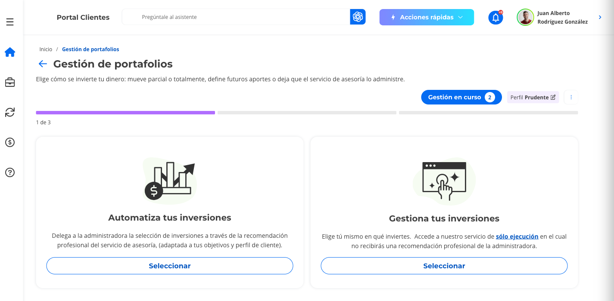
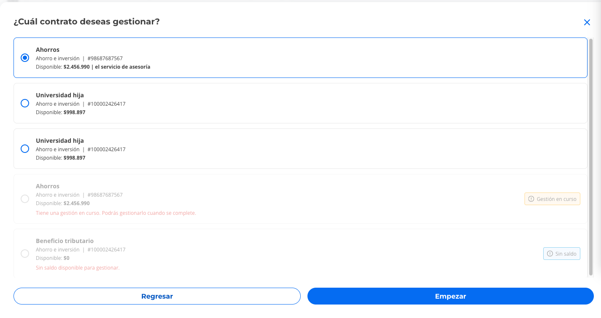
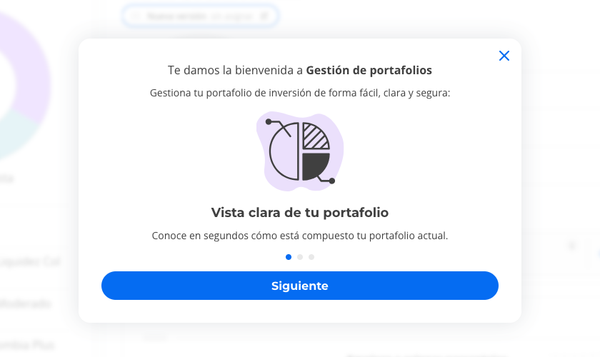
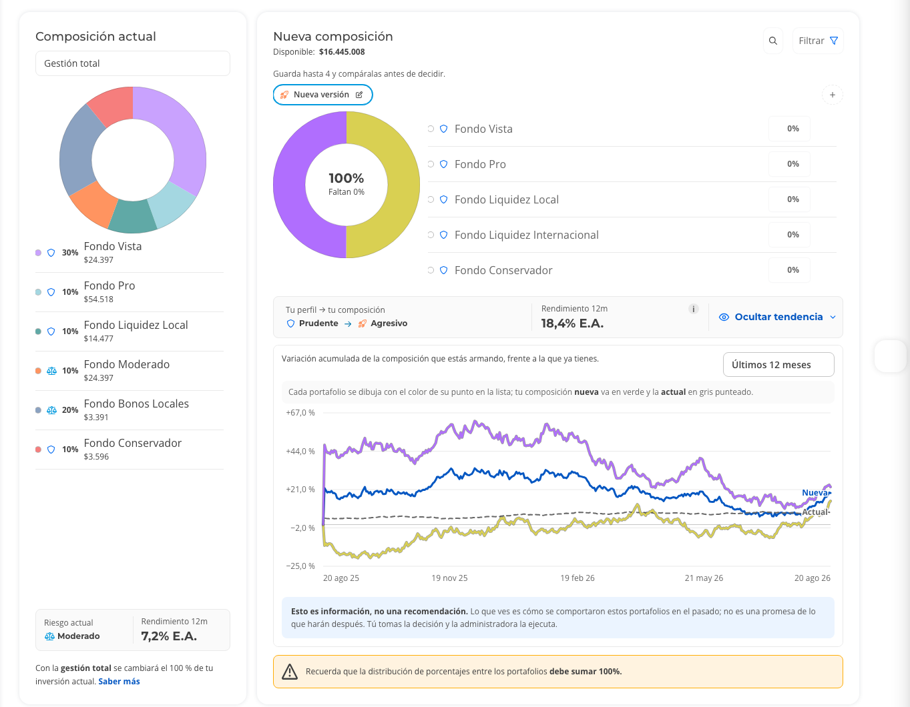
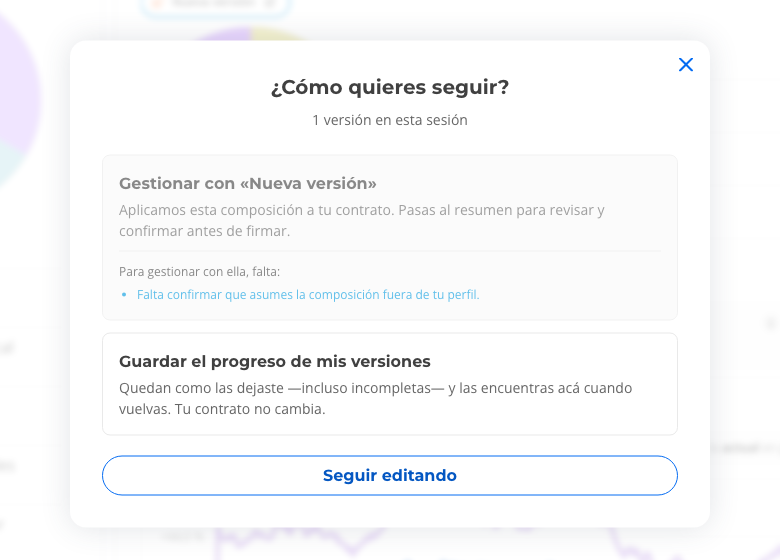
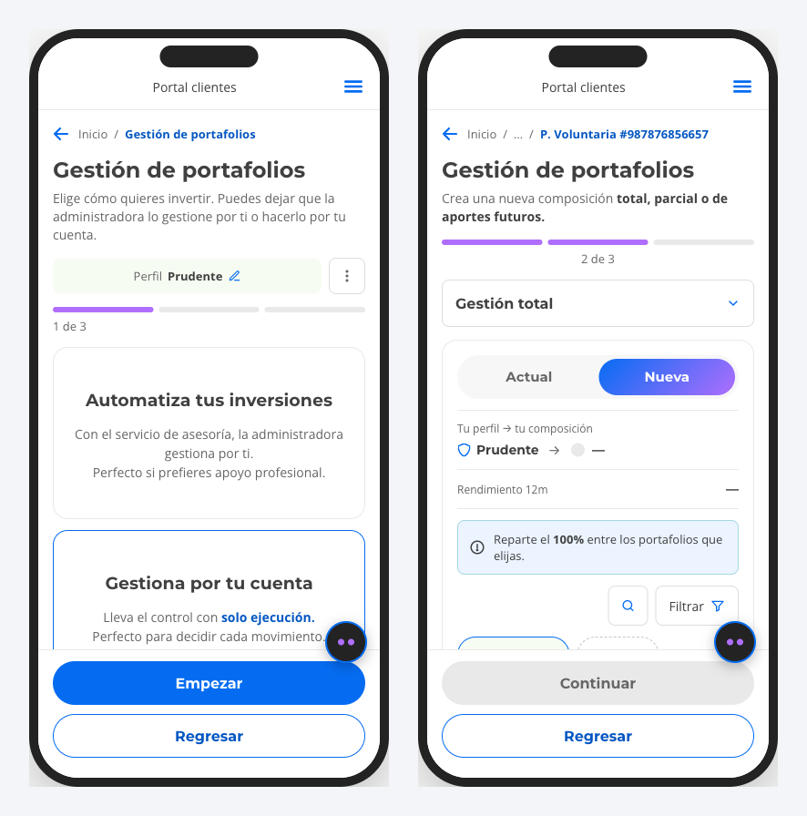
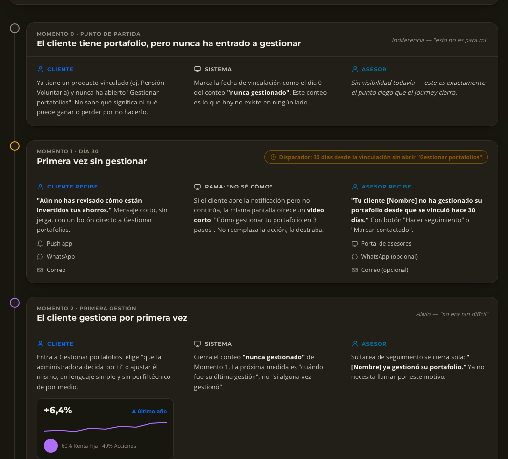
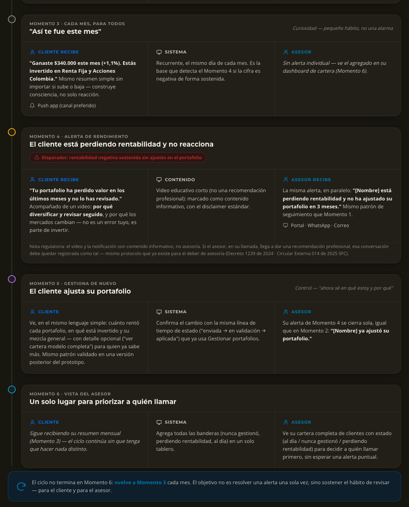

---
# Translated from texto.es.md. Delete the "traduccion" line once you've reviewed it.
# Anonymized case: no company name, no absolute client or AUM figures, no commercial segment names.
traduccion: por revisar
titulo: Portfolio Management 2.0
bajada: Not a transaction, a relationship. An investment portal that supports users in deciding what to do with their money.
rol: Product Designer · Product Owner
resumen: Product vision for the portfolio management portal of an investment and pension fund manager in Colombia. Moving from a transactional window to supporting users in three moves, based on 6 months of behavioral data.
origen: Investment and pension fund manager in Colombia
periodo: Jul – Oct 2026
equipo: Initiative under review, not yet launched
herramientas: [Databricks, Qualtrics]
portada: ./01-composicion-y-comparador.png
portadaAlt: Portfolio management screen with the current allocation on the left and the new one on the right. The comparison shows the user's profile is Prudent and the new allocation is Aggressive, with the 12-month return and a trend chart against the current allocation.
prototipo: prototipos/gestion-portafolios/index.html
destacado: true
orden: 2
---

## Summary

The portfolio management portal worked like a service window: it let users complete the transaction, but didn't support them in the most important decision, what to do with their money. Very few clients with digital access used it, and almost everyone who came in didn't come back.

Based on 6 months of real portal behavior and users' own words, I proposed a product vision in three moves: **I reach out, I explain, I make it easy**. I prototyped the third one end to end, on desktop and mobile, and put it through a preliminary review with synthetic agents representing the client segments.

> Not a transaction. A relationship.

## Context and problem

Before talking about how to improve the portal, we had to see how many people weren't using it at all:

- Only **7.72%** of clients with digital access managed their portfolio. The other 92.28% could, and didn't.
- The channel mattered: people who used both the app and the portal were **5.6 times** more likely to manage their portfolio (26.03%) than those who used only the portal (4.64%). Among portal-only users, 95.36% didn't manage anything.

And of those who did come in, most didn't stay:

- **96%** visited their investment profile only once.
- **59%** managed their portfolio once and never came back.
- **69%** completed their profile but didn't act on it.

It wasn't a lack of interest. Nobody was supporting them between one transaction and the next.

> "I don't know if my portfolio is doing well or could do better. I don't understand it."

> "Why is there no advice after you invest your money?"

## Research

I combined three sources:

- **Behavioral data.** I analyzed 6 months of portal usage in Databricks: who manages, from which channel, where they drop off and how many times they change their choice before deciding.
- **Users' own words.** Open-ended answers from a Qualtrics survey.
- **Behavioral segmentation.** Five client segments, from people just starting to invest to people looking for peace of mind close to retirement, each with different motivations and preferred channels.

**What I found at the moment of decision**

- **They can't see how they've done:** only 1 in 3 checks their returns before moving their money.
- **There's no risk signal:** nothing warns them when their allocation contradicts their profile.
- **They guess:** 82.4% change their choice several times, trying and correcting blindly.
- **They can't find help:** only 0.09% use help during portfolio management, because it doesn't show up.
- **They drop off on mobile:** 55% abandonment on mobile, and 10.7% restart the flow without finishing.

> "It's hard for me to understand the concepts and find my way around the tools."

## Design process

I framed the proposal as a relationship built in three moves, in a cycle: each loop strengthens the bond and brings users back.

**I. I reach out.** The relationship starts when the platform takes the first step, with a reason to come back that isn't paperwork.

- The message changes by segment: progress for people just starting, protection for people thinking about their family, calm scenarios for people approaching retirement.
- The channel is also chosen by segment and urgency: app notification, email, WhatsApp or a phone call.
- When the data detects friction, such as retries or abandonment, the channel escalates from a notification to a WhatsApp message or a call from an advisor.

**II. I explain.** Once users are there, they don't just see data: they're told what it means for them. Returns inside the flow, risk in real time, plain language and help one tap away.

**III. I make it easy.** Understanding isn't enough if deciding is still hard:

1. **Guided options** based on the user's profile, in one tap and customizable afterwards.
2. **Allocation vs. profile comparison**, so the decision stays aligned with the user's suitability.
3. **Scenario simulator** to project and compare before executing. Users were already doing this by hand, changing and undoing.
4. **Save progress** to pick up where they left off.
5. **Redesigned mobile**, where half of users were dropping off.

**Desktop first.** 72.75% of users managed their portfolio from desktop, and that channel accounted for 86.44% of interactions. That's why the flow was designed and validated there first, then brought to a touch-friendly mobile version.

**Regulation.** The flow follows Colombia's duty-of-advice framework: it separates the service with a professional recommendation from execution-only, makes clear that the information shown isn't a recommendation, and asks for confirmation when the allocation falls outside the user's profile.

## Validation

A preliminary review was run with **synthetic agents**: five panels, one per behavioral segment, each with five simulated people built from the segment's documented profiles. Each person went through the prototype on desktop and mobile, commented on every screen and rated clarity, trust and ease from 1 to 5. In the panel of people just starting to invest, the scores were calculated with 4 of the 5 people; the fifth responded later and confirmed the same findings.

| Segment | Clarity | Trust | Ease |
| --- | --- | --- | --- |
| Just starting to invest | 4 | 3 | 3.5 |
| Building wealth | 3 | 3 | 4 |
| Protecting their family | 3 | 3 | 2 |
| Investors with capital | 4 | 4 | 3 |
| Seeking stability, near or in retirement | 2 | 3 | 2 |

**What worked**

- **The stop when the allocation falls outside the profile** was the most valued element across all five segments. It's perceived as real protection, not decoration.
- **The profile vs. allocation comparison**, with returns and trend, was the best-received piece among people who already invest: "This is exactly what I do in another app before moving a single peso."
- **Saving versions without changing the account** takes away the pressure of deciding all at once.

**What caused friction**

- **Being left alone at the moment of greatest doubt.** Right when the allocation falls outside the profile, the only way forward is a checkbox. Three segments asked to talk to an advisor at that moment: "'You make the decision' sounds like they're leaving me alone right at the most important moment."
- **The warning comes too late.** The stop appears at the end, when confirming, not while splitting the percentages.
- **"I explain" is missing.** The prototype covers "I make it easy", but doesn't translate returns and risk into what matters to each person: their children's university, their pension income, retirement. "They hand me the hammer, but don't tell me which nail to hit."
- **Signals that erode trust:** a duplicated account in the list, crypto assets mixed with traditional funds without a separate warning, and an all-or-nothing flow with no partial management.
- **People who don't use digital channels wouldn't get here on their own.** For them, the entry point has to be "I reach out": email, SMS or a call from an advisor, with the option for a family member to manage on their behalf.

**Next iteration**

1. A visible "talk to an advisor" button at the moment of going outside the profile, in addition to the confirmation.
2. Move the risk warning to the moment of splitting percentages and separate crypto assets with their own warning.
3. Connect the allocation to each person's goal and enable partial management and future contributions.
4. Clean up test data before testing with clients.

Synthetic agents help catch problems early, but they don't replace real users. The next step is to test the flow with clients and cross the results with qualitative research.

## Final solution

A [clickable prototype](../../../prototipos/gestion-portafolios/index.html) of the **I make it easy** move, on desktop and mobile: choose how to invest, choose the account, build the allocation and confirm. The screens are in Spanish.

**Choose how to invest.** Users decide whether to delegate management to the advisory service or manage on their own with execution-only, with the difference explained in plain language.

**Choose the account.** Shows the available balance of each account and explains why some can't be managed right now, for example because they already have a request in progress or have no balance.

**A guided welcome.** The first time, a short introduction explains what users can do on the screen.

**Build the allocation with the comparison.** On the left, the current allocation; on the right, the new one. As users split the percentages, they see in real time how their allocation compares with their profile (in the example, from Prudent to Aggressive), the 12-month return and the trend against what they already have, with a note that this is information, not a recommendation.

**Save progress and confirm.** Users can save up to 4 versions and come back later without changing their account. If the allocation falls outside their profile, they must confirm they accept it before continuing.

**Mobile.** The same flow with touch-friendly cards, a Current / New view and the profile comparison always visible.

**The size of the opportunity.** Clients who can manage their portfolio and don't are about 12 times those who do: a potential 12x growth in adoption. Getting there requires bringing each client's segment, profile and actual allocation together in one place: without that data, neither the segmented message of "I reach out" nor the comparison of "I make it easy" can exist.

### Next iteration: a cycle with the advisor (not tested)

Based on the review findings, I designed a two-lane journey, **client and advisor**, for people just starting to invest: people who already have a portfolio but don't review it on their own. It isn't a screen redesign: it's a cycle that turns silence ("I've never managed my portfolio") into a monthly review habit. The advisor isn't just another channel, they close the loop.

It has 7 recurring moments:

0. **Starting point.** The client has a portfolio but has never managed it. The system starts counting from onboarding, a data point that doesn't exist today.
1. **Day 30 without managing.** The client gets a short, jargon-free message with a direct button to manage, plus a 3-step video if they don't know how. The advisor gets the same alert to follow up.
2. **First management.** The client decides in plain language and the advisor's task closes on its own.
3. **"How you did this month".** A monthly summary whether it goes up or down, to build a habit, not just a reaction.
4. **Performance alert.** If returns drop over time and the client doesn't react, they get an educational video, and the advisor gets the same alert. The content is flagged as informational, not advice.
5. **Manage again.** They see how each portfolio performed and what it's invested in, with optional detail for those who know more.
6. **Advisor view.** A dashboard with the status of their whole book (up to date, never managed, losing returns) to decide who to call first.

This iteration responds to what the synthetic agents asked for: a person at the moment of greatest doubt, alerts that arrive before the client gets lost, and plain language. **It wasn't tested.** Before production, business and legal need to validate the window that triggers the performance alert, each alert's default channel and the final video script.

## Learnings

- **The problem wasn't the interface, it was the relationship.** The data showed people came in once and didn't return. Better screens weren't enough: they needed a reason to come back and support between one transaction and the next.
- **Combining data and users' words changes the question.** Databricks showed where people dropped off; the survey comments explained why. Neither source alone would have led to "I reach out, I explain, I make it easy".
- **Explaining in the moment beats informing.** Risk signals and returns help when they appear right at the decision, not on another screen.
- **Regulation is design too.** Separating advice from execution-only, clarifying that information isn't a recommendation and asking for confirmation outside the profile were built into the flow as part of the experience, not as legal text at the end.
- **Synthetic agents speed things up, but don't replace people.** They make it possible to test the proposal from several profiles quickly; final decisions still need to be validated with real clients.
