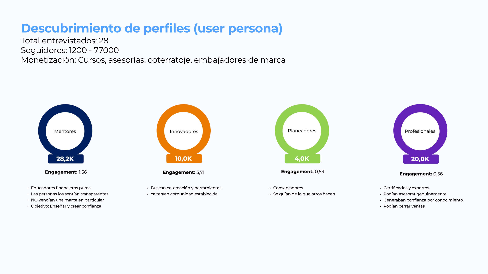
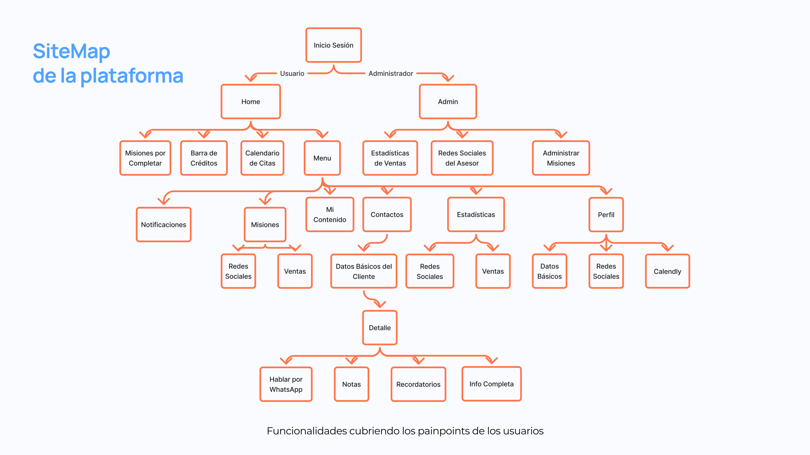
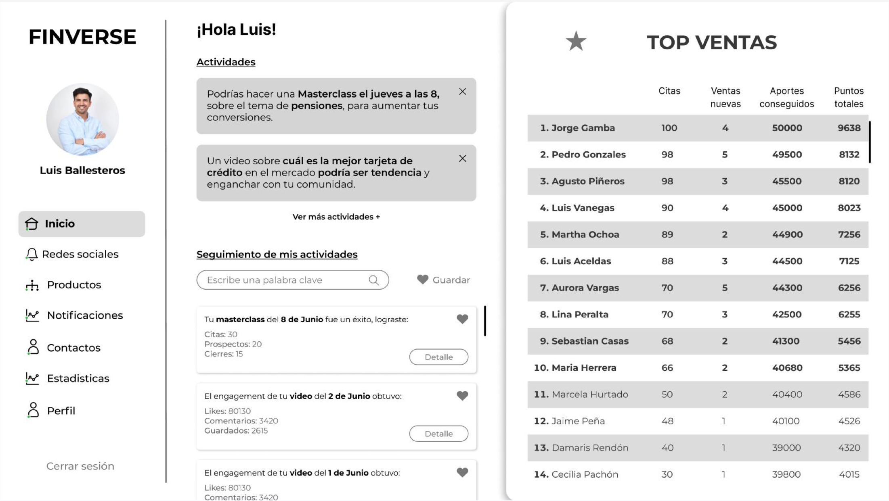
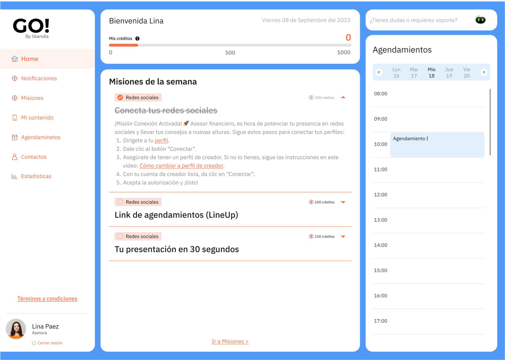
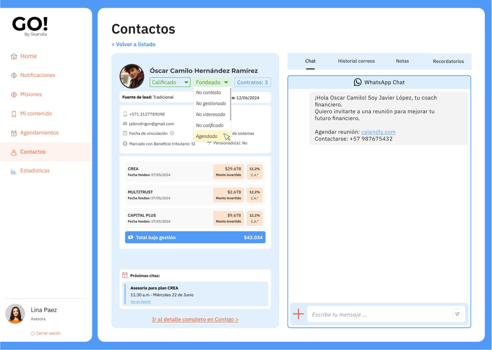
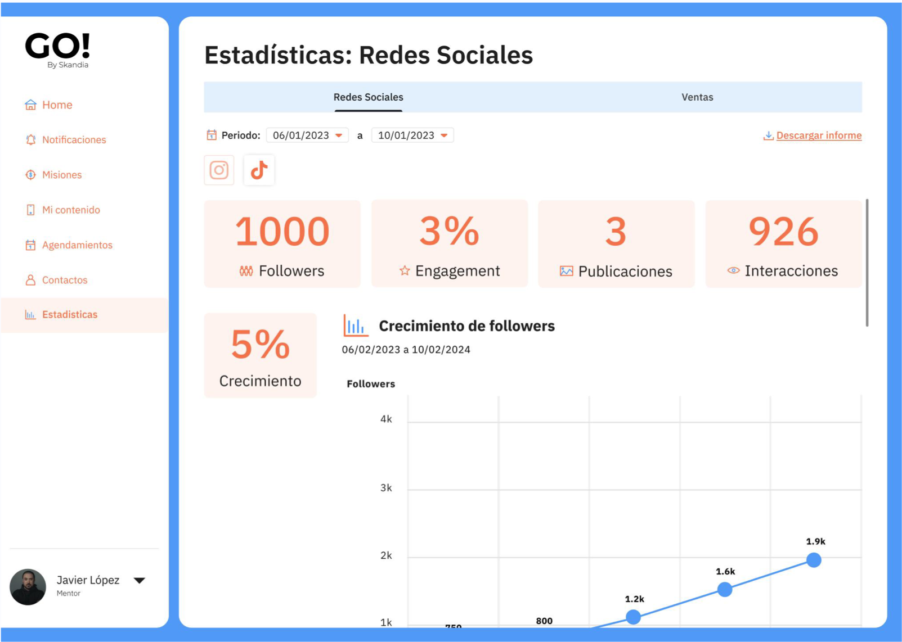

---
# Translated from texto.es.md. Delete the "traduccion" line once you've reviewed it.
traduccion: por revisar
titulo: Go by Skandia Advisors
bajada: A platform that helps new digital advisors create content, build a community and manage their leads
rol: Product Designer · Product Owner
resumen: Skandia's advisors were spending more than half their time on manual tasks. Researching the problem changed the question and led to designing, validating and launching a platform for digital advisors.
origen: Skandia · Financial advisors at Skandia Mexico
periodo: Sep 2022 – May 2025
equipo: PM, Sales, Growth Hacker and Designer / PO, with the development team
herramientas: [Maze, WordPress]
portada: ./05-misiones.png
portadaAlt: Go by Skandia home screen with the credits bar, the week's missions and the appointment calendar.
destacado: true
orden: 3
---

## Summary

Skandia's financial advisors were spending 50% to 60% of their time on manual operational tasks. The initial goal was to automate them, but research showed that would only solve half the problem: the real challenge was generating more potential clients at once.

After validating and discarding three hypotheses through experiments, the team decided to train digital advisors from scratch and give them a platform to create content, build a community, generate and manage leads, and close sales. As Designer and PO, I researched, designed, tested, prioritized and led the development team all the way to production.

> "When real money is at stake, the human factor still matters."

## Context and problem

Skandia's financial advisors **spent 50% to 60% of their time on manual operational tasks**: emails, messages, follow-ups and contact management. That kept them from focusing on what actually generated revenue: selling.

- **Initial goal:** lighten that load by automating tasks, so advisors had more time to sell and generate more leads.
- **Business goal:** improve the productivity of the traditional channel.
- **Users:** financial advisors at Skandia Mexico.

**Team roles**

- **PM:** set the vision, prioritized the roadmap and aligned the team with business goals.
- **Sales:** connected with advisors, managed their participation in pilots and brought back feedback from the field.
- **Growth Hacker:** tested strategies to attract and retain users, measured results and optimized acquisition.
- **Designer / PO (my role):** researched, designed, tested, prioritized, led the development team and made sure the product solved users' real needs.

## Research

1. **Semi-structured interviews with 10 advisors.** I confirmed they lost a lot of time on manual tasks and that automation was necessary, but it would only solve 50% of the problem.
2. **Semi-structured interviews with 10 of their clients.** I found they wanted a human and digital tools at the same time.
3. **Digital ethnography of the top-performing advisors.** They were building communities on social media: creating educational content, earning trust and closing sales naturally. They also generated more leads at once: one post reaches 500 people, while one meeting is a single prospect.

> The real challenge was: how can advisors generate more potential clients at the same time so that automation pays off?

**Opportunity.** Top performers reached hundreds of people through social media, built trust by building community and sold without pressure, with financial information that drove purchases. The solution sat at the intersection of three ideas: a guide to create and sell, social media content and automations.

### Three hypotheses put to the test

**1. Trust through matching.** People would trust their advisor more if they were matched with an "ideal" profile based on their risk profile and needs.

- **What I built:** a WordPress landing page with a 3-question profiling form and automatic matching with advisors by profile, launched on social media.
- **Result:** no leads and no traction.
- **My analysis:** the problem wasn't connecting users with advisors. People didn't go to social media to take "profile quizzes", and friction wasn't reduced enough.

**2. Self-advisory.** If clients advised themselves through smart questions, they would discover their ideal products and the advisor would only step in to close, saving time.

- **What I built:** a self-diagnosis flow with questions about finances, automatic product recommendations and a connection with the advisor only to close, launched on social media.
- **Result:** 5 leads and 0 sales.
- **My analysis:** people didn't want to advise themselves; they wanted a human from the start. This reinforced the insight that the human factor matters when money is at stake.

After discarding these two hypotheses, we pivoted toward the people who were transforming how finance is sold and taught: **finfluencers**. The goal was to understand their motivations, challenges and strategies for building community and trust.

**Finfluencer profiles.** We interviewed 28, with between 1,200 and 77,000 followers, who monetized through courses, advisory, brokerage and brand partnerships. We found four profiles:

| Profile | Engagement | Traits |
| --- | --- | --- |
| Mentors | 1.56 | Pure financial educators, seen as transparent; didn't sell any particular brand; their goal was to teach and build trust. |
| Innovators | 5.71 | Looked for co-creation and tools; already had an established community. |
| Planners | 0.53 | Conservative; followed what others did. |
| Professionals | 0.56 | Certified experts; could genuinely advise, built trust through knowledge and could close sales. |

**3. Working with established finfluencers.** If we worked with Mentors (transparent educators) and Professionals (experts who close), they could generate leads through their existing communities.

- **What I did:** I reached out to several Mentors and Professionals. They already had a track record, established habits on social media and communities shaped in a particular way.
- **Result:** very few real conversions; the leads they captured already knew them, and we weren't scaling.
- **My analysis:** working with established finfluencers was harder than expected. Their identities were already set, their communities had other expectations, and changing their habits required more effort than they could give.

**The final decision.** Instead of convincing existing finfluencers to sell for Skandia, we decided to create digital advisors from scratch and give them a platform to help them.

## Design process

**Drivers and barriers workshop.** I ran it with 12 users and defined the most important pain points to start working with an impact/effort matrix:

- Managing their contacts efficiently.
- Staying active on social media.
- Making better use of their time.
- Improving their social media performance.
- Organizing their content and keeping it safe.
- Getting real-time feedback on their performance.

**Platform architecture.** The sitemap covers those pain points with two journeys: the advisor's (missions, credits bar, appointment calendar, content, contacts, statistics and profile) and the admin's (sales statistics, advisors' social media and mission management).

**Prototyping.** The first version explored suggested activities, results tracking and a sales ranking.

## Validation

**Tree test.** We believed finfluencers would understand the sitemap structure and be interested in the proposed features.

- **We observed:** an average complexity of 4. In open answers, users valued product sales tracking, statistics and activities, without rejecting any particular feature.
- **We learned:** they struggled to understand the flow needed to complete tasks, but were genuinely interested in the features.
- **We did:** we restructured the sitemap to improve comprehension and usability.

**Usability test.** I built and tested the prototype with 8 users, who completed the missions, scheduling, statistics and contact actions flows in Maze.

| Indicator | Rating |
| --- | --- |
| Experience | 4.2 / 5 |
| Satisfaction | 4.6 / 5 |
| Ease of use | 4.1 / 5 |

What users said:

- "It would help me know how many appointments I've had, and have more measurement of my sales work."
- "In Statistics, it's great that it shows the growth in the relationship with the client."
- "The platform is confusing when nothing happens after you select an option."

**Conclusion:** the platform is perceived as useful. The lower ratings came from unfamiliarity with Maze, not from the flows.

## Final solution

A platform that lets **new** digital advisors learn to create educational content, build a community from scratch, generate leads at scale, manage them efficiently and close sales naturally.

**Missions and credits.** Each week the advisor gets guided missions, such as connecting their social accounts or preparing a 30-second pitch, that add up to credits. The same screen shows their appointment schedule.

**Contacts.** A profile for each client with their sales status, products, upcoming appointments and a WhatsApp chat to message them without leaving the platform.

**Statistics.** Followers, engagement, posts, interactions and growth of the advisor's social media, plus a sales view.

**Adoption and support in production**

- Onboarding, training and constant contact with users in production.
- Fast bug fixes, releases and improvements based on real feedback.
- Live monitoring of metrics and adoption.

**What we achieved**

1. Onboarding, support and direct help for users during initial adoption.
2. Activity metrics and sales and social media results.
3. An iteration process based on feedback from users and admins for continuous improvement in production.

## Learnings

- **Less is more.** Each feature had to be launched and tested incrementally to test, measure and adjust its adoption before adding more functionality.
- **More cross-team communication.** Regular meetings with the people leading content and growth were needed to align expectations and needs on both sides.
- **Fast, clear metrics.** Define specific OKRs for each key feature and track the adoption curve week by week from the first use case.

> A successful platform isn't just a technical achievement. It's the result of listening to users, measuring and adjusting every feature constantly, and aligning every team that designs, builds and supports the experience.
