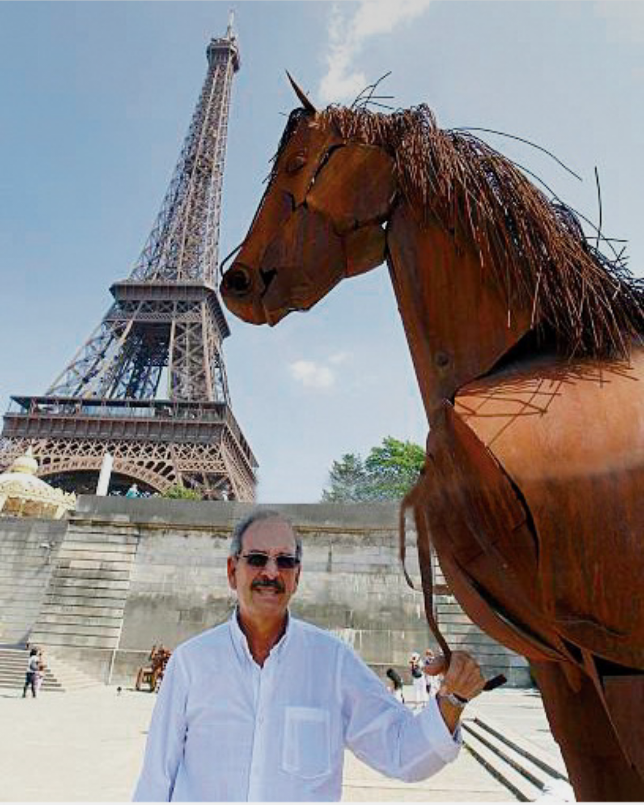
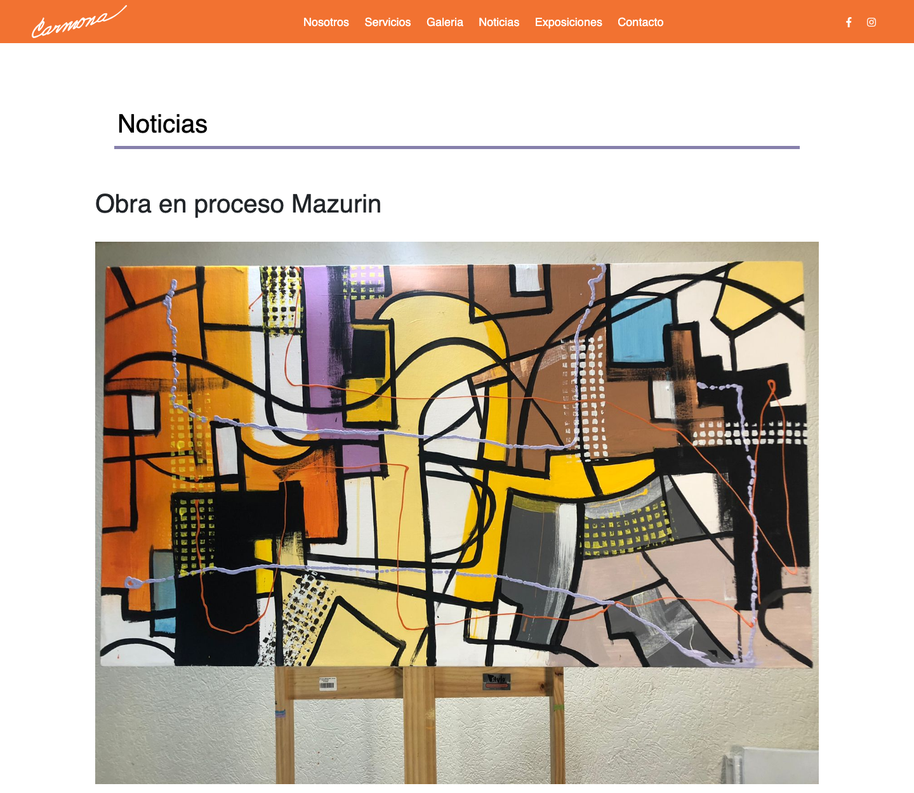
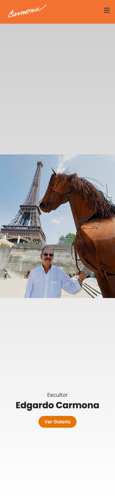

## Resumen

Diseñé y desarrollé un sitio web de portafolio de artista, visualmente atractivo, que muestra la creatividad del escultor Edgardo Carmona, presenta su obra, ofrece la información básica del museo y funciona como galería virtual. Me encargué del diseño y la diagramación del sitio, y lo construí desde cero con HTML, CSS y JavaScript, sin plantillas.

## Contexto y problema

El Museo Carmona reúne la obra del escultor Edgardo Carmona. El sitio debía cumplir tres funciones: mostrar su obra, dar la información básica del museo y servir como galería virtual, con una identidad visual propia del artista.

El museo ya tenía un sitio web, pero se veía desorganizado, genérico y no reflejaba la estética del artista.

El artista quería un espacio para publicar toda su obra y poder presentarla en distintos países a través de representantes de arte. El sitio tenía que funcionar como su carta de presentación ante ese público.

## Investigación

- **Conversaciones con el artista.** Escuché la visión que quería expresar y para qué necesitaba el sitio.
- **Análisis de la obra.** Identifiqué los colores presentes en sus obras para construir la paleta del sitio a partir de ellos, en lugar de imponer una estética externa.
- **Objetivo del sitio.** Reunir toda su obra en un solo lugar y presentarla ante representantes de arte en diferentes países.

## Proceso de diseño

- **Estética y narrativa visual.** Las definí junto al propietario del museo para fortalecer la identidad y la presencia digital del artista.
- **Arquitectura de la colección.** Organicé la colección completa en una galería digital navegable y estructuré la información del artista. La galería se divide por técnica (esculturas, pinturas, dibujos, vitrocerámica, murales, jarrones, lámparas y música) y las esculturas, a su vez, en abstractas y figurativas. Cada obra lleva su título y su año.
- **Desarrollo.** Construí el sitio desde cero con HTML, CSS y JavaScript, sin plantillas, para que fuera ligero, responsive y funcional.

## Validación

**Feedback posterior, comunicado por el artista.** El artista me contó que mostró la página a varios representantes de arte, que les gustó y pudieron ver sus obras de manera fácil y organizada. Es un testimonio indirecto sobre la recepción del sitio; no realicé pruebas de usabilidad con esos representantes.

El sitio se validó con el artista y se refinó en varias iteraciones con él hasta llegar a la versión publicada.

## Solución final

Un sitio publicado en [museocarmona.com](https://www.museocarmona.com/) con tres partes:

- **Inicio:** presenta al escultor con una imagen de gran formato y lleva directo a la galería.
- **Galería virtual:** la obra organizada por técnica, con filtros, título y año de cada pieza, videos de algunas esculturas y un reproductor de música.
- **Noticias:** obras en proceso y novedades del artista.

El sitio se adapta a pantallas móviles, con un menú desplegable.

## Aprendizajes

- **Gestión de la relación con el cliente.** Aprendí a comunicarme con claridad, a negociar y a llegar a acuerdos para construir algo lo más cercano posible a lo que el artista imaginaba.
- **Negociar entre la visión y las restricciones técnicas.** No todo lo que se imaginaba era viable con la tecnología de ese momento. Parte del trabajo fue proponer alternativas y acordar soluciones que respetaran su intención.
- **Traducir una visión subjetiva en decisiones de diseño concretas.** Partir de los colores de su obra y de lo que quería expresar dio un criterio objetivo para discutir decisiones estéticas con alguien que tiene una identidad artística muy definida.
- **Iterar con el cliente como parte del proceso.** Las rondas de revisión no fueron un retraso: cada una acercó el sitio a su visión y fortaleció la confianza en el resultado.
- **Diseñar pensando en la audiencia final.** El sitio no solo debía gustarle al artista; debía funcionar para los representantes de arte que lo verían desde otros países.
