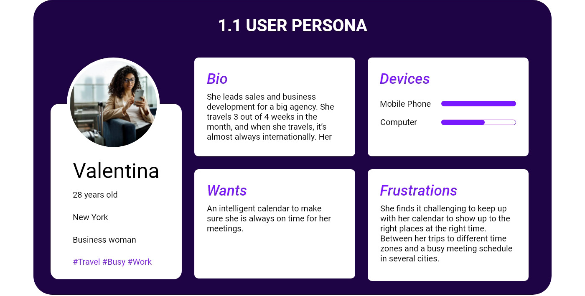
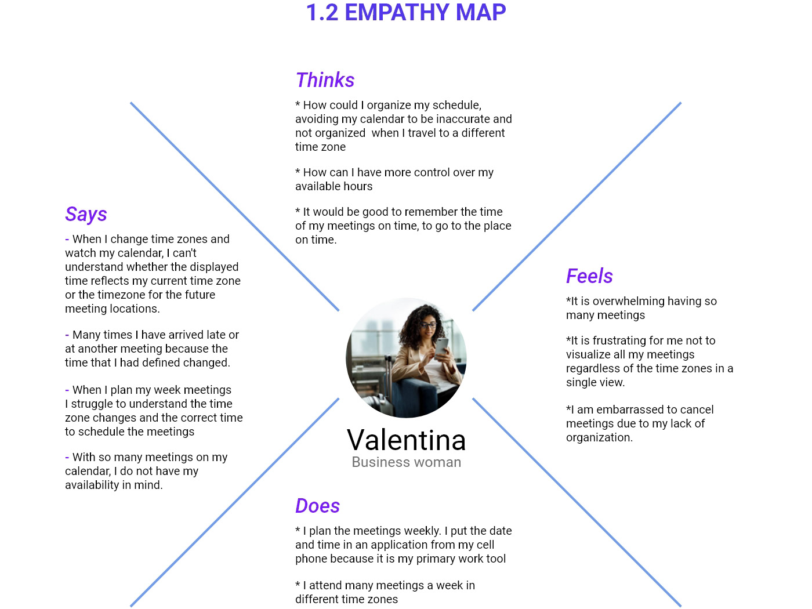
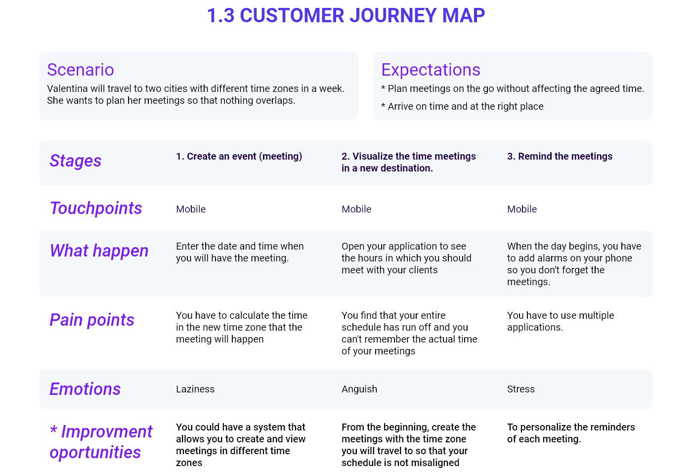
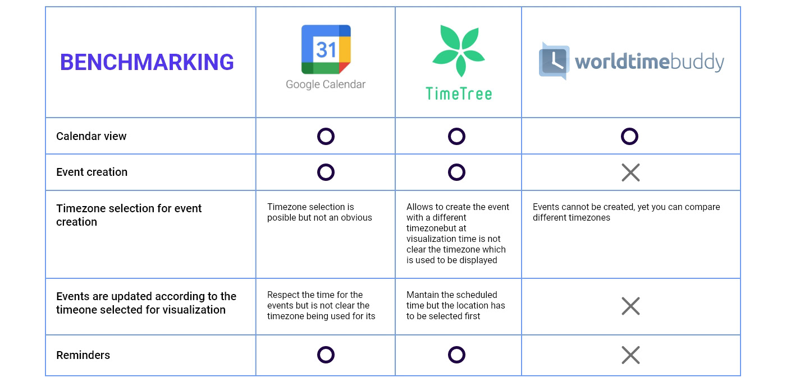
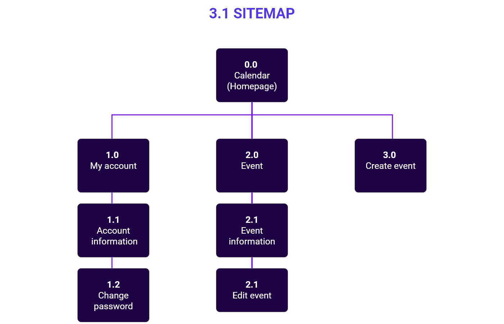
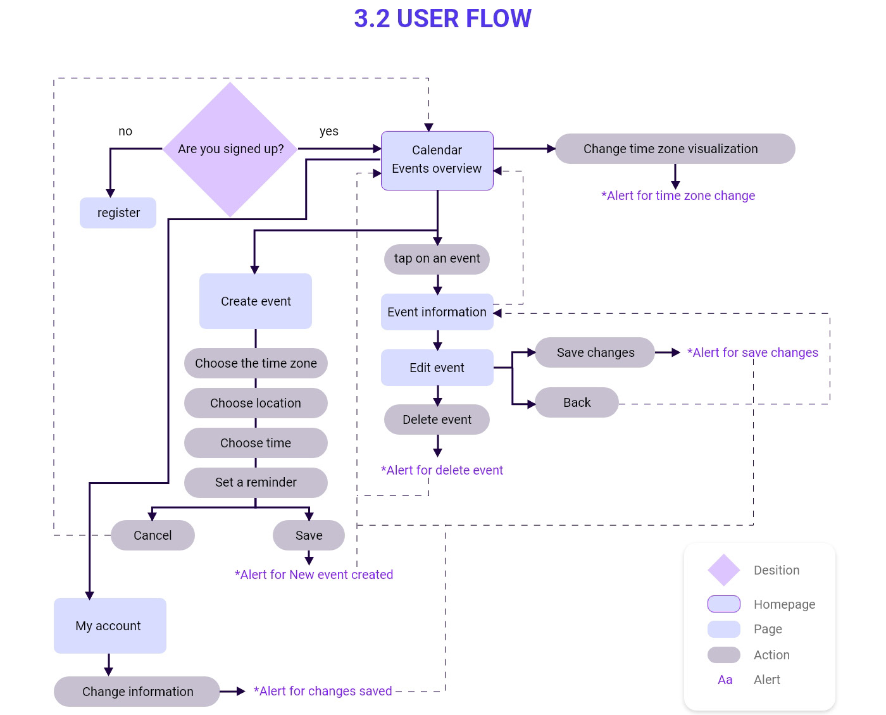
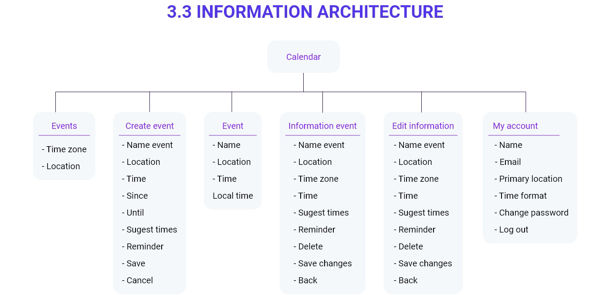
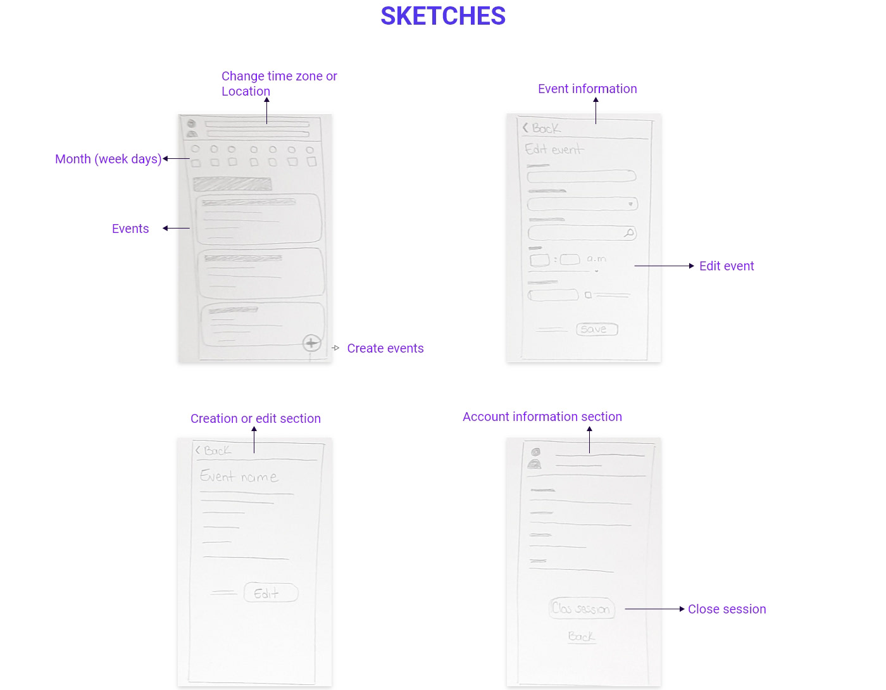
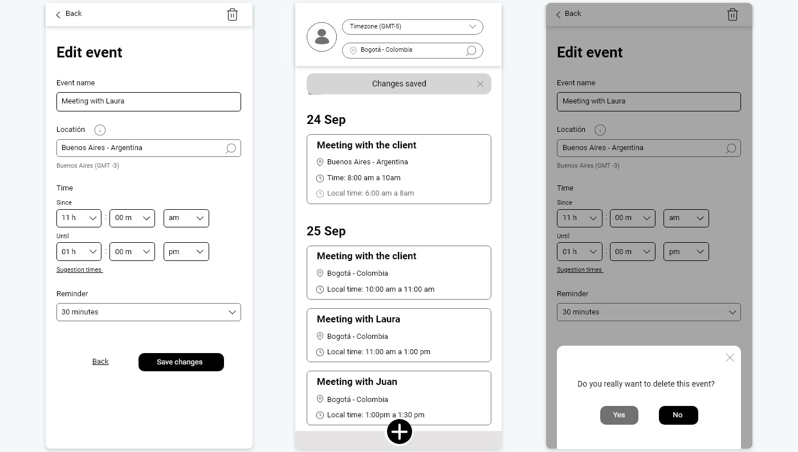
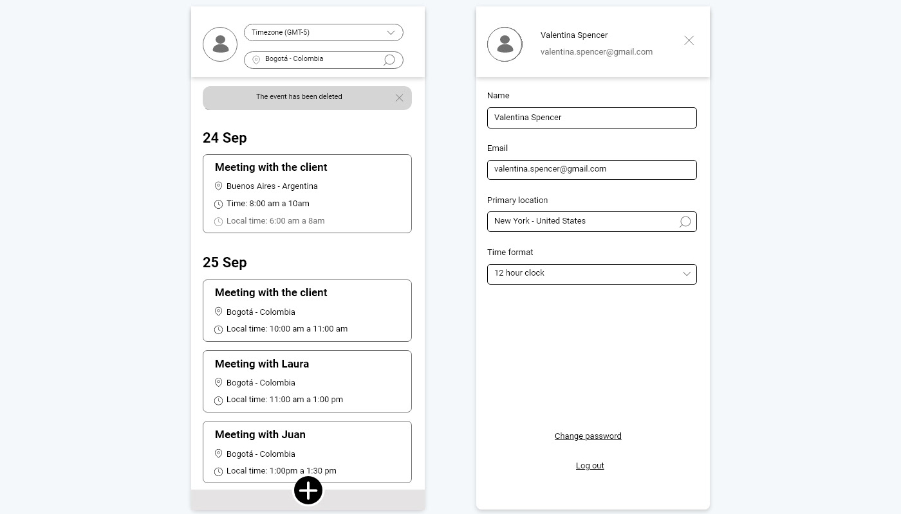

## Summary

Business people who travel worldwide have trouble organizing and viewing their schedules because of time zone changes. myCal is a mobile application that lets them create and view meetings in the different time zones they will travel to, so they can be on time anywhere.

This was a design exercise for a job application. I took it from user definition to wireframes: user persona, empathy map, customer journey, benchmarking, sitemap, user flow, information architecture, sketches and wireframes.

## Context and problem

**Overview.** Business people traveling worldwide have problems organizing and visualizing their schedules because of the time zone changes.

**Project goal.** Provide business people a tool to organize and visualize their schedule more efficiently, regardless of the time zone they are in or the time zone they will be in.

## Research

**User persona.** Valentina, 28, lives in New York and leads sales and business development for a big agency. She travels 3 out of 4 weeks a month, almost always internationally, and mainly uses her mobile phone.

- **Wants:** an intelligent calendar to make sure she is always on time for her meetings.
- **Frustrations:** keeping up with her calendar to show up at the right place at the right time, between trips to different time zones and a busy meeting schedule in several cities.

**Empathy map.** It captured what Valentina says, thinks, does and feels. For example: "When I change time zones and look at my calendar, I can't tell whether the time shown is my current time zone or the one for the future meeting location." She feels overwhelmed by the number of meetings and embarrassed to cancel them because of a lack of organization.

**Customer journey.** Scenario: Valentina will travel to two cities with different time zones in one week and wants to plan her meetings so nothing overlaps. The journey covers three stages: create a meeting, view meetings in a new destination and get reminded of them.

| Stage | Pain point | Opportunity |
| --- | --- | --- |
| Create an event | Calculating the time in the new time zone where the meeting will happen | Create and view meetings in different time zones |
| View meetings in a new destination | The whole schedule shifts and she can't remember the actual time of her meetings | Create meetings in the destination's time zone from the start, so the schedule doesn't shift |
| Get reminded | Having to use several apps | Personalize the reminder for each meeting |

**Competitive analysis.** I compared Google Calendar, TimeTree and World Time Buddy. Google Calendar lets you pick a time zone, but it isn't obvious. TimeTree creates events in another time zone, but it isn't clear which time zone is being displayed. World Time Buddy compares time zones but can't create events or reminders. None of them makes the time zone of each meeting clear.

## Design process

**Structure.** I defined the sitemap with three branches from the calendar (My account, Event and Create event), the user flow with every action and confirmation alert, and the information architecture of each screen.

**Sketches.** I sketched the key screens on paper: the calendar with the time zone or location selector, event information, creating or editing an event, and the account section.

## Validation

The exercise's scope went as far as wireframes: it didn't include user testing. The next step would have been a usability test of the main flows (creating an event in another time zone and switching the calendar's time zone) to check that destination time and local time are understood without ambiguity.

## Final solution

The wireframes put the time zone at the center of the experience:

- **Time zone selector on the calendar.** Changing the time zone or location updates the whole calendar. Each meeting shows its time at the destination and the user's local time.
- **Create events with a location.** Choosing the meeting's location sets its time zone automatically, with suggested times and a customizable reminder.
- **Edit, delete and confirm.** Every action ends with a confirmation message, such as "New event created", "Changes saved" or "The event has been deleted".
- **My account.** Primary location and time format (12 or 24 hours).

## Learnings

- **The real problem was comprehension, not functionality.** The calendars I analyzed already handled time zones, but didn't make clear which time they were showing. That's why the solution focuses on making the time zone visible, not on adding features.
- **A well-defined persona guides every decision.** Valentina's concrete scenario, two cities in different time zones in one week, worked as a test for every screen: if it didn't solve that scenario, it didn't make it in.
- **Showing two time references requires hierarchy.** Displaying both destination time and local time on each meeting removes mental math, but only works if the visual hierarchy makes clear which is which.
- **Confirmations build trust.** In a tool where a mistake means arriving late to a meeting, confirming every action (create, save, delete) gives users confidence.
- **An exercise needs a next step too.** Without user testing, the decisions remain hypotheses. Validating the wireframes would have been the way to confirm them.
